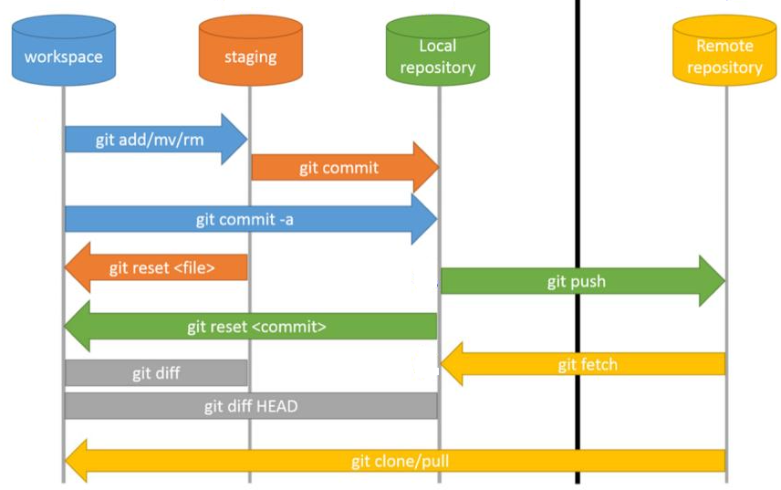

<br>

## Table of Contents
- [Given problem](#given-problem)
- [The structure of Git](#the-structure-of-git)
- [Options of git commit command](#options-of-git-commit-command)
- [Push commits to the remote branch](#push-commits-to-the-remote-branch)
- [Take a commit from a branch to the other branch](#take-a-commit-from-a-branch-to-the-other-branch)
- [Undo commits of a branch](#undo-commits-of-a-branch)
- [Remove a commit](#remove-a-commit)
- [Combine multiple commits into one](#combine-multiple-commits-to-one)
- [Move HEAD to the specific commit](#move-head-to-the-specific-commit)
- [Wrapping up](#wrapping-up)


<br>

## Given problem

Normally, when working with Git, the local modifications will be staged or indexed. Then they will be considered as a commit with a specific version - SHA1 in the local repository. To synchronize between the local repository and the remote repository, we need to use **git push** command.

But there are some cases that we want to do with these commits such as revert or undo our actions, recommend the already commits, ...

How do we deal with it?

<br>

## The structure of Git

Before going straight forward to our problems, we will look at an image that describe the flows of Git.



Some command places of git:
1. workspace

    This is our current working directory.

2. The staging area

    The staging area or index is a virtual place that collects all the files that we want to include in the next commit.

3. Local repository

4. Remote repository

<br>

## Options of git commit command

Belows are actions of **git commit** command.
- Using **git add** command to index all untracked or modified files before using **git commit** command.

- Syntax

    ```bash
    git commit <options>
    ```

    The meaning of some options:
    - **-a** ot **- -all**: automatically stage files that have been modified or deleted. It does not affect to the new files.

    - **-C \<commit\>** or **- -reuse-message=\<commit\>**: use the message of the specific commit.

    - **-c \<commit\>** or **- -reedit-message=\<commit\>**: edit the commit message by using editor.

    - **-m** or **- -message=\<msg\>**: define a message for our commit.

    - **- -allow-empty-message**: when using script files with git, we can use this option.

    - **- -amend**: it will modify the last commit by adding the current changes to it.

        ```bash
        git commit --amend -m "<our-message>"
        ```

        The **- -amend** option is used when we want to rewrite the comment, and change the content of its commit.

<br>

## List all commits's history

```bash
git reflog
```

This command is very crucial because it is used to rebuild a branch after removing, ...

<br>

## Push commits to the remote branch

1. To the remote branch that has already existed

    ```bash
    # if we are in the local branch that is correpsonding the remote branch
    git push
    ```

2. To the new branch that hasn't already existed in remote repository

    ```bash
    git push -u origin <branch-name>
    ```

    **-u** means **- -set-upstream**.

<br>

## Take a commit from a branch to the other branch

In order to solve our problem, use **git cherry-pick** command. Belows are some cases that we usually encounter.

1. Pick a commit from a branch to master branch

    ```bash
    git checkout master

    # 1st - get the previous commit of HEAD pointer of <branch-name>
    git cherry-pick <branch-name>~1

    # or 2nd - specify the hash code of the commit that we want
    git cherry-pick <commit>
    ```

2. Assuming that we have a mistake that committed to the master branch, but we want to push that commit to the other-branch. And remove that commit in the master branch.

    ```bash
    # 1st step: take the wanted commit to the other-branch
    git branch <other-branch>

    # 2nd step: in master branch, reset HEAD to the previous commit
    git reset --hard HEAD~1

    # 3rd step: swith to the other-branch
    git checkout other-branch
    ```

3. Pick n commits from a branch to master branch

    ```bash
    git checkout master

    # specify many commits
    git cherry-pick <commit1> <commit2>

    # specify from commit 1 to commit n by using ... symbol
    # commit1 will not be included to the other branch
    git cherry-pick <commit1>...<commitn> 

    # to reduce the limitation of an above statement.
    git cherry-pick <commit1>^..<commitn>
    ```

4. Pick a commit to the two branches

    ```bash
    # assuming that we have some changes in branch 1
    git add .
    git commit -m "This is commit of branch 1"

    # switch to the branch 2 that we want to apply the latest commit of branch 1
    git checkout branch-2
    git cherry-pick branch-1
    ```

<br>

## Undo commits of a branch

0. Undo to the starting state before merging with the other branch

    Assuming that we want to merge the master branch to the feature branch, we can find that there are multiple conflicts, then we want to recover to the state before merging.

    ```bash
    git reset --hard ORIG_HEAD
    ```

1. Using git reset command

    **git reset** command used to reset current HEAD to the specified state, and remove the history of that commit.

    Before jumping to use git reset, we need to notice some places that this command affects: workspace, staging area or index, local repository.

    - Syntax

        ```bash
        # reset the current branch's HEAD to commit id
        git reset <mode> <commit>
        ```

        When using **git reset** command, we need to notice about some types of mode.
        - **- -soft**

            This mode will only change HEAD to commit in local repository, not affect to our workspace, and the staging area. So, if we use **git add**, and **git commit** command, our branch will go to the previous reset commit.

            ```bash
            git reset --soft HEAD
            ```

        - **- -hard**

            This mode will change our workspace such as untracked files, modified files, the staging area, and the local repository.

            ```bash
            # go back to HEAD
            git reset --hard HEAD

            git reset --hard HEAD~1

            # or
            git reset --hard HEAD^
            ```

            After using **git reset** with our branch, we feel that we want to undo this action means that going to the ith commit after current HEAD.

            ```bash
            # go to the i commit after the current HEAD
            git reset --hard HEAD@{ith}

            git reset --hard HEAD@{1}
            ```

        - **- -mixed**

            This mode will change both the local repository and the staging area, but still remain the changes in our working space.

            ```bash
            git reset <commit-id>

            git reset HEAD
            ```

        - **- -merge**
        - **- -keep**

    Finally, to synchronize commits between the local repository and the remote repository, we need to use the following command:

    ```bash
    git push -f
    ```

    **Using git reset command when we want to repair the commits in the local repository.**

2. Using git revert command

    Unlike **git reset** command, git revert does not remove their commit's history. This command will create a new commit that's the opposite (or inverse) of the given SHA. If the old commit is **matter**, the new commit is **anti-matter** — anything removed in the old commit will be added in the new commit and anything added in the old commit will be removed in the new commit.

    So, we will use git push to send the new inverse commit to undo our mistaken commit.

    - When to use

        - when our commits that are pushed to the remote repository. Because if we use **git reset** command, all the previous commits's history will be removed, we do not track them. Using **git revert** command is suitable in this case.

    ```bash
    git log --oneline

    # commit-id that we want to revert
    git revert <commit-id>

    # push this new reverted commit to our branch
    git push -f origin <our-branch> 
    ```

    To get exactly the commit's id, use **git log** command to list all history log.

    - Revert initial git commit

        ```bash
        git update-ref -d HEAD
        ```
<br>

## Remove a commit

1. Using **git reset** command

    ```bash
    # revert to HEAD pointer will get rid of work in progress,
    # it will erase all the changes in our working tree and index.
    git reset --hard HEAD

    # revert to the previous commit of HEAD
    git reset --hard HEAD~1

    # or if we want to revert to the specific commit
    git reset --hard <commit>

    # finally, synchronize with the remote repository
    git push origin HEAD --force
    ```

2. Take an important commit when using **git reset --hard** command

    ```bash
    # list all commits
    git reflog

    # then, select which commit that we want to go back
    # syntax: git reset --hard <commit-id>
    git reset --hard HEAD@{2}
    ```

<br>

## Combine multiple commits into one

In this section, we will use git rebase command with interactive mode where there are squash (or fixup) value to apply our problem.
- squash: do not change the previous commit's messages
- fixup: remove the commit's message

```bash
# determine all commits that we want to merge
git log --oneline

# results:
# 12c5de8 (HEAD ->  our-branch) refactor code 3
# 74dde89 refactor code 2
# 56ier4e refactor code 1
# ue86e3o resolve other problems

# now, we want to merge the 3 commits before HEAD such as 12c5de8, 74dde89, 56ier4e.
git rebase -i HEAD~3

# or the other format of git rebase: use commit-id that is out of the commit-ids we want to merge
# git rebase -i ue86e3o 

# Then, in editor, we have the state of each commit's message
# pick 12c5de8 refactor code 3
# pick 74dde89 refactor code 2
# pick 56ier4e refactor code 1

# To merge the 3 commits, we should change "pick" word to "squash" or "fixup".
# pick 12c5de8 refactor code 3
# squash 74dde89 refactor code 2
# squash 56ier4e refactor code 1

# Save and close editor
```

<br>

## Move HEAD to the specific commit

Supposed that we push some commits to the local repository like the below:

```bash
# refer to the https://git-scm.com/docs/git-checkout#_description
           HEAD (refers to branch 'master')
            |
            v
a---b---c  branch 'master' (refers to commit 'c')
    ^
    |
  tag 'v2.0' (refers to commit 'b')
```

Now HEAD and master branch are referring to the same commit **c**. To move HEAD pointer to the commit **b**, use the following command:

```bash
# move HEAD to commit-id
# syntax: git checkout <commit-id>

git checkout HEAD^

# result:
   HEAD (refers to branch 'b')
    |
    v
a---b---c  branch 'master' (refers to commit 'c')
    ^
    |
  tag 'v2.0' (refers to commit 'b')
```

Finally, HEAD refers to the commit **b**, master branch refers to the commit **c**. So, we can call this state is being in detached HEAD state.

For example:

```bash
         HEAD (refers to commit 'f')
	      |
	      v
      e---f
     /
a---b---c---d  branch 'master' (refers to commit 'd')
    ^
    |
  tag 'v2.0' (refers to commit 'b')
```

The drawback of this detached state:
- When we want to move to the master branch's commit by using **git checkout master**, our new commits that turn from commit **b** such as **e**, **f** can be deleted by the routine Git garbage collection process, if they aren't reference by something else.

Solution for this detached state:
- Create a new reference for these commits. In the above image, it is commit **f**.

    ```bash
    # 1st way: create a new branch and switch to it
    # now, HEAD refer to the new-branch, and the new-branch refers to the commit f
    git checkout -b <new-branch>

    # 2nd way: create a new branch
    # the new-branch refers to the commit f
    git branch <new-branch>

    # 3rd way
    git tag <new-branch>
    ```

<br>

## How to use patch file

0. Create a patch file in a branch

    ```bash
    git diff > file_name.patch

    # push file into specific folder of patch file
    git diff > ./patch_folder/file_name.patch
    ```

1. Create a patch file from commits

    ```bash
    # from one commit
    git format-patch COMMIT_HASH_ID

    # from the last two commit
    git format-patch HEAD~2

    # from all commits that have not push to remote branch yet
    git format-patch origin/master

    # Create patch file contains binary data
    git format-patch --binary --full-index origin/master
    ```

2. Apply a patch file to our branch

    ```bash
    git apply -v patch-name.patch

    # apply a patch that is created from format-patch
    git am patch-name.patch

    # apply patch file that do not use git
    patch < patch-name.patch

    ```

<br>

## Wrapping up

- Understanding some cases that we will deal with commits.

<br>

Refer:

[https://medium.com/@nguynthanhhip/m%E1%BB%99t-s%E1%BB%91-c%C3%A2u-l%E1%BB%87nh-git-ph%E1%BB%95-bi%E1%BA%BFn-b5d5f63b7ddc](https://medium.com/@nguynthanhhip/m%E1%BB%99t-s%E1%BB%91-c%C3%A2u-l%E1%BB%87nh-git-ph%E1%BB%95-bi%E1%BA%BFn-b5d5f63b7ddc)

[https://quantrimang.com/hoat-dong-update-trong-git-157692](https://quantrimang.com/hoat-dong-update-trong-git-157692)

[https://www.programmersought.com/article/60051711556/](https://www.programmersought.com/article/60051711556/)

[https://medium.com/mindorks/use-of-git-reset-git-revert-git-checkout-squash-commit-2b721ca2d2d3](https://medium.com/mindorks/use-of-git-reset-git-revert-git-checkout-squash-commit-2b721ca2d2d3)

[https://github.blog/2015-06-08-how-to-undo-almost-anything-with-git/](https://github.blog/2015-06-08-how-to-undo-almost-anything-with-git/)