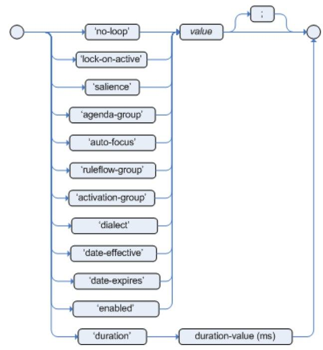

<br>

## Given problem
- [The structure of Drools Language](#the-structure-of-drools-language)
- [Declaration part](#declaration-part)
- [Implementation part with statements](#implementation-part-with-statements)
- [MVEL dialect](#mvel-variable)
- [How to use variable in Drools](#how-to-use-variable-in-drools)
- [How to resolve conflicts when there are multiple the same conditions](#how-to-use-conflicts-when-there-are-multiple-the-same-conditions)
- [Wrapping up](#wrapping-up)


<br>

## The structure of Drools Language

Belows are some parts in Drools Language that we need to know.
1. Declaration part

2. Implementation part with statements

<br>


## Declaration part

The first thing when we want to define rules in .drl file is to declare package that this file is contained, and the following lines is places of classes that we use.

```drl
package <package_name>

import <class_in_package>
import <class_in_package>
```

For example:

```drl
package com.manhpd.rule1

import com.manhpd.domain.Customer;
import com.manhpd.domain.Employee;
```

<br>


## Implementation part with statements

1. Declare rules's name and attributes

    ```drl
    rule "rule_name"
        <define_attributes>

    end
    ```

    In the **define_attributes** option, we usually define a dialect. Dialect is used to define the syntax for our code logic such as conditions, ...

    The default dialect is Java. But we can use the additional MVEL expression language in drl file. MVEL supports the getter/setter methods.

    Belows are some common attributes that Drools makes.

    

2. The structure of Rule

    ```drl
    when
        <conditions>
    then
        <actions>
    ```

    If conditions are true, then our actions will be implemented. Sometimes, conditions can be called LHS - Left Hand Side, actions called as RHS - Right Hand Side.

3. For example

    ```drl
    rule "rule_name"
        dialect "mvel"

        when
            <conditions>
        then
            <actions>
    end
    ```

<br>

## MVEL dialect

1. Common operations

    - Equal

        - ClassName(condition1, condition2, ...)
        - ClassName(condition1 && condition2 && ...)

    - Use OR construct

        Classname(condition1 \|\| condition 2 \|\| ...)

    - Value correction

        For example: "3456" = 3456

2. Expressions in MVEL and Java

    - Get the value of a field in an object

        - Java: ```employee.getAge();```

        - MVEL: ```employee.age```

    - Get the value of a field with checking null

        - Java

            ```java
            if (employee.getAddress() != null) {
                return employee.getAddress().getDistrict();
            }

            return null;
            ```

        - MVEL: ```employee.?address.district```

    - Compare strings

        - Java: ```"John".equals(employee.getName());```

        - MVEL: ```employee.name == '50'```

    - Check whether a list contains an item or not

        - Java: ```Arrays.asList("John Wick", "Jack").contains(employee.getName());```

    - Check null for an object

        - Java: ```employee == null```

        - MVEL: ```employee == nil``` or ```employee == null```

    - Set value for a field of an object

        - Java: ```employee.setName("Johnson")```

        - MVEL: ```employee.name = "Johnson"``` or ```employee.name = 'Johnson'```

3. Collections in MVEL

    - Lists

        - names = ["John Wick", "Jack Reacher"]
        - names[0]

    - Arrays

        - {"John Wick", "Jack Reacher"}
        - Strings are arrays:

            - name = "John";
            - name[0]

    - Maps

        - person = ["first_name" : "John", "last_name" : "Wick"]
        - person["first_name"]
        - person.first_name

<br>

## How to use variable in Drools

Assuming that we have the model of Employee, it will be describe the below source code.

```java
public class Employee {
    private int age;
    private int name;
    private String address;

    // get, set
}
```

```drl
// definition of drl file

global com.manhpd.statistics.NumEmployee numEmployee;

rule "Age validation of Employee"
    dialect "mvel"

    when
        $employee: Employee(age > 18)
    then
        System.out.println("Information of employee that is enough age: " + $employee);
        numEmployee.increment();
end
```

So, we should use **$** symbol with a name to define a variable. And Drools can work with the native Java types.

If we want to define a global variable in a session, use the **global** keyword.

<br>

## How to resolve conflicts when there are multiple the same conditions

Using salience keyword to set the priority for each rule. The default value of salience is 0, but it can be negative or positive.

If a rule has a higher priority, it will be implemented first.

For example:

```drl
rule "higher priority"
    salience(5)

    when
        <conditions>
    then
        <actions>
end
```

<br>

## Wrapping up

- Understanding about MVEL expression language to define rules in drl file.

<br>

Refer:

[https://docs.drools.org/5.3.0.CR1/drools-expert-docs/html/ch05.html](https://docs.drools.org/5.3.0.CR1/drools-expert-docs/html/ch05.html)

[https://www.tutorialspoint.com/drools/drools_rule_syntax.htm](https://www.tutorialspoint.com/drools/drools_rule_syntax.htm)

[https://www.tutorialspoint.com/drools/drools_rules_writing.htm](https://www.tutorialspoint.com/drools/drools_rules_writing.htm)

[http://support.streamx.co/intro/basic-drools-rule-language-syntax-cont](http://support.streamx.co/intro/basic-drools-rule-language-syntax-cont)

[https://www.studytonight.com/drools/rule-syntax](https://www.studytonight.com/drools/rule-syntax)

[https://www.guru99.com/drools-tutorial.html](https://www.guru99.com/drools-tutorial.html)