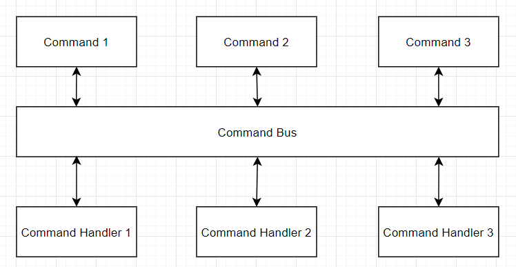

<br>

## Table of contents
- [Given problem](#given-problem)
- [Solution with Command Bus pattern](#solution-with-command-bus-pattern)
- [Source code](#source-code)
- [Benefits and Drawbacks](#benefits-and-drawbacks)
- [Some problems with Command Bus pattern](#some-problems-with-command-bus-pattern)
- [The relationship with other patterns](#the-relationship-with-other-patterns)
- [Wrapping up](#wrapping-up)


<br>

## Given problem

The problem of CommandBus pattern is the child problem of CQRS architectural pattern. The only one question below always exists in our head: How to separate the commands and queries in our system?

Because when our system has became to be more complex, our database is usually our bottlneck that we need to solve. Because the locking mechanism helps us prevent some problems of concurrency access. But it also creates another problem that is about performance.

Then, by separate Command and Query concept into two things in CQRS architectural pattern, it improves considerably our performance.

So, how do we implement Command Bus pattern?

<br>

## Solution with Command Bus pattern

Below is an diagram for Command Bus pattern.



In this pattern, there are three classes that is utilized.
1. Command class

    Command class is only a class that contains the needed data to execute our action. It is like the Data Transfer Object pattern.

    The relationship between Command and CommandHandler is one-to-one. It means that one Command will only be handled by one CommandHandler.

    In Command class, we can do some simple validation for its data, and Command object is an immutable object.

2. CommandHandler class

    CommandHandler's responsibility is to execute the appropriate domain behavior when taking a specific Command object as input. The CommandHandler should not be doing any domain logic itself. If we need to do more than this, we should define a service to wrap that logic.

    The domain behavior should be executed in an AggregateRoot. So, CommandHandler class will load an AggregateRoot by using the repository, and pass its data to an AggregateRoot.

3. CommandBus class

    After receiving a Command object, CommandBus will route it to the suitable CommandHandler.

    To extend the functionality of CommandBus class, we can use Decorator pattern or Proxy pattern with it. In the case of Decorator pattern, there are some samples for CommandBus's extension:
    - Wrap CommandBus in a database transaction.
    - Wrap CommandBus with logging, measuring time for CommandHandler.

    With Proxy pattern, wraps CommandBus to check permissions before handling our command.

<br>

## Source code

Normally, we can use HashMap in CommandBus to handle the connection between Command and CommandHandler. But in our case, we will take advantage of DI principle or IoC container in Guice to map Command and CommandHandler.

Belows are steps that we need to implement in Command Bus pattern.

1. Create a generic interface **ICommand** and its implementation.

    ```java
    public interface ICommand<R> {
        // nothing to do
    }

    @Getter
    @AllArgsConstructor
    @NoArgsConstructor
    public class WithdrawMoneyCommand implements ICommand<Void> {
        private String username;
        private String amount;
        private String account;
    }
    ```

2. Create a generic interaface **ICommandHandler** and its implementation.

    ```java
    public interface ICommandHandler<C, R> {
        R handle(C command);
    }

    public class WithdrawCommandHandler implements ICommandHandler<WithdrawCommand, Void> {
        @Override
        public Void handle(WithdrawCommand command) {
            System.out.println(WithdrawCommandHandler.class.getName() + " handled.");
            return null;
        }
    }
    ```

3. Define the concrete Module in **Guice** to combine **Command** and **CommandHandler** classes.

    Because we have multiple command handlers that implement **ICommandHandler** interface, so we will use **Multibinder** to accept the classes that implements the same **ICommandHandler** interface.

    ```java
    public class CommandHandlerModule extends AbstractModule {
        @Override
        protected void configure() {
            Multibinder<ICommandHandler> commandHandlerBinder = Multibinder.newSetBinder(binder(), ICommandHandler.class);
            commandHandlerBinder.addBinding().to(RegisterCommandHandler.class);

            // define the other derived class of ICommandHandler interface
        }
    }

    public class MainModule extends AbstractModule {
        @Override
        protected void configure() {
            this.install(new CommandHandlerModule());
            this.bind(ICommandBus.class).to(CommandBusImpl.class);
        }
    }
    ```


4. Create **ICommandBus** interface and its implementation.

    ```java
    public interface ICommandBus {
        <C> void execute(C command);

        <C extends ICommand<R>, R> R execute(C command);
    }
    ```

    The definition of **CommandBusImpl** class:

    ```java
    public class CommandBusImpl implements ICommandBus {
        private Set<ICommandHandler> commandHandlers;

        @Inject
        public CommandBusImpl(Set<ICommandHandler> commandHandlers) {
            this.commandHandlers = commandHandlers;
        }

        @Override
        public <C> void execute(C command) {
            return (ICommandHandler<C, Void>) findCommandHandler(command);
        }

        @Override
        public <C extends ICommand<R>, R> R execute(C command) {
            return (ICommandHandler<C, R>) findCommandHandler(command);
        }

        private <C> ICommandHandler<C, ?> findCommandHandler(C command) {
            Class<?> commandClazz = command.getClass();
            return this.commandHandlers.stream()
                                       .filter(handler -> this.canHandleCommand(handler.getClass(), commandClazz))
                                       .findFirst()
                                       .orElseThrow(() -> new RuntimeException("Do not handle " + commandClazz.getName()));
        }

        /**
         * check the parameters's type that is corresponding to the type of Command class
         *
         */
        private boolean canHandleCommand(Class<?> handlerClazz, Class<?> commandClazz) {
            Type[] genericInterfaces = handlerClazz.getGenericInterfaces();
            ParameterizedType handlerIntefaceType = null;

            for (Type type : genericInterfaces) {
                if (type instanceof ParameterizedType) {
                    handlerIntefaceType = (ParameterizedType) type;
                    break;
                }
            }

            Class<?> acceptableParameterClass = (Class<?>) handlerIntefaceType.getActualTypeArguments()[0];
            return acceptableParameterClass.equals(commandClazz);
        }
    }
    ```

5. So, we have:

    ```java
    import com.google.inject.Guice;
    import com.google.inject.Injector;
    import com.manhpd.bus.ICommandBus;
    import com.manhpd.command.WithdrawCommand;

    public class Application {
        public static void main(String[] args) {
            Injector injectorHandler = Guice.createInjector(new MainModule());
            ICommandBus commandBus = injectorHandler.getInstance(ICommandBus.class);

            WithdrawCommand command = new WithdrawCommand("John", "100000", "john");
            commandBus.execute(command);
        }
    }
    ```

<br>

## Benefits and Drawbacks

1. Benefits

    - This pattern is suitable for Domain-Driven Design pattern. It only focuses on what actions that Client can do by defining Command. So our business logic does not leak in another layers.

        The communication between user and developer is really smoothly. Because they can easily understand what other says.

    - Take advantage of the other patterns, we can extend the CommandBus's behaviors.

    - With CommandBus class, we can handle Command objects in asynchronous way.
        
        Using asynchronous way, it can improve:
        - our system's performance because we can utilize multithread to deal with it.
        - UX because response to the user fastly.

2. Drawbacks

    - If we do not take carefully about coding CommandHandler, we can make our CommandHandlers that does not abide by SRP.

    - Normally, we utilize reflection to map between Command and CommandHandler. So, it can also influence to our system's performance in runtime.

<br>

## Some problems with Command Bus pattern

1. Sometimes, in CommandHandler class, we define multiple actions but does not focus on its primary action.

    For example, supposed that we logged in a website. The primary action of this command is to validate information that contains username - password, and save this session of this current user. Also, we need to nofity that using email for the current user that there is someone that is currently utilizing their account.

    So the secondary action is that sending email to the current user.
    
    If we implement the multiple secondary actions in our CommandHandler. It makes our CommandHandler class pollution, and it does not satisfy the Single Responsibility Principle.

    Our solution for this case is that define an global event for each secondary action. It means that we will use Event Bus pattern.

    Also, we need to be aware of the difference between the global event and domain event.
    - With the external behavior, we should use the global event.
    - With the domain behavior, we should fire the domain event.

<br>

## The relationship with other patterns

1. Command pattern and Command Bus pattern

    - Command pattern does not relevant to the Command Bus pattern.
    
    - Command pattern solves the problem that is decoupling between Invoker and Receiver, and Command object hide the real object that work an action by defining an method.

    - Command Bus pattern is used to decouple between the declaration of use cases and their implementation, and Command object is only a message that contains data for executing an action.

        And CommandHandler is a class that implements the business logic.

        So, in the reality, Command object is only a message that passed to the CommandHandler.

2. Command Bus pattern and Message Bus pattern

    - Command Bus pattern is a specific pattern of Message Bus pattern. Because with message or command object, we always are be aware of its handler or its destination.

<br>

## Wrapping up

- Nowadays, to implement CommandBus pattern, we usually use DI pattern by using reflection and annotations to inject them.

- Another implementation of CommandBus pattern that without using DI framework such as Spring Container, Guice, CDI, we will define all commands in Database. So, in the runtime, we will load all of them.

<br>

Refer:

[https://github.com/cloudogu/command-bus](https://github.com/cloudogu/command-bus)

[https://github.com/fdside/commandbus](https://github.com/fdside/commandbus)

[https://www.sitepoint.com/command-buses-demystified-a-look-at-the-tactician-package/](https://www.sitepoint.com/command-buses-demystified-a-look-at-the-tactician-package/)

[https://matthiasnoback.nl/2015/01/a-wave-of-command-buses/](https://matthiasnoback.nl/2015/01/a-wave-of-command-buses/)