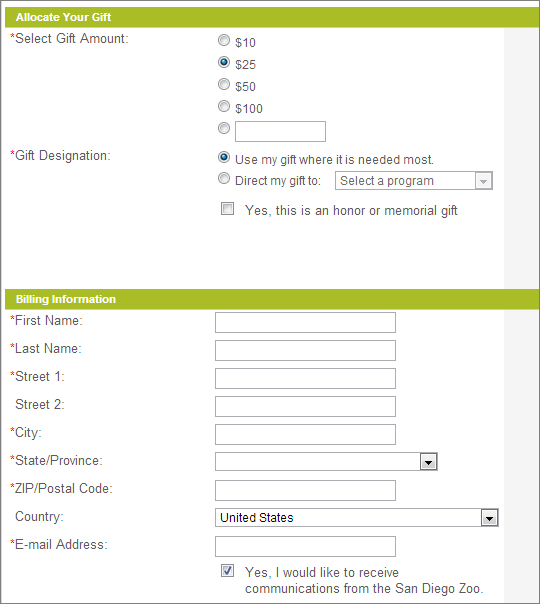

 

## Table of contents
- [Given problem](#given-problem)
- [Solution with Data Transfer Object pattern](#solution-with-data-transfer-object-pattern)
- [When to use](#when-to-use)
- [Benefits and Drawbacks](#benefits-and-drawbacks)
- [Wrapping up](#wrapping-up)

 

## Given problem

Assuming that we have an below image that describes information that we want to send from Client to Server.

If an above image has multiple fields in groups, how do we send data to server?
- First way, sending each group's fields to server.
- Second way, sending all data to user in one call.

Which way does we choose for our problem ?

 

## Solution with Data Transfer Object pattern

Belows are some common knowledge about DTO that we need to know.
- Data Transfer Object is only a class that contains data with getter/setter methods.
- It contains the serialization and deserialization mechanism.
- DTO doesn't contain the business logic.

Then, we will dig deeper into how DTO applied in some archiectural patterns.
1. Layered achitecture pattern

    Normally, we will use DTOs between multiple processes, or systems. So, in this architecture, we will use it in some places.
    - Receive data from Client to Server

        DTO will be used in Spring's RestController. It will be used to map request to DTO.

    - Send data from Server to Client

        Layered architectural pattern will use database-centric approach. It means that our business logic will lean toward entities. Then, some developers can use an entity with APIs to expose data to client. But it is a bad idea because:
        - Tightly coupling between our persistent model and APIs. It's difficult to maintain when new requirements always change, then data that Client wants will be also modified.

        - We can expose what Client does not want, and can event leak the important information.

        To know more about the problem exposing entities in API, we can see the following [link](https://thorben-janssen.com/dont-expose-entities-in-api/).

        To avoid encountering this problem, we will use DTO to hide all the core data to the world.

2. Domain Driven design

    The way to use DTO in Domain Driven design is as almost same as the Layered architecture pattern.
    - Receive data from Client
    - To send data from Server to Client, we need to convert Domain Model to DTO, not using entities.
    - DDD uses Bounded Context concept to isolate subdomains. So to communicate between other Bounded Contexts, we will use DTOs to loose coupling between subdomains.

 

## When to use

- In Domain-driven design, we need to use DTO to communicate between bounded contexts, and return data to Client.

- In Restful system, we usually utilize DTO pattern to transfer data between client and server.

 

## Benefits and Drawbacks

1. Benefits

    - Reduce the number of calls from client to server, and vice versa.

    - Encapsulate the serialization mechanism for transferring data over the wire. By encapsulating the serialization like this, the DTOs keep this logic out of the rest of the code and also provide a clear point to change serialization should you wish.

    - We only pass the necessary data from Server to Client without full fields from Domain Model, or Entity. So, the less data passed through network, the less bandwidth that is taken. And we doesn't expose too much data to the end user, it prevent the leak other important information.

    - Decoupling between APIs with our persistent model - entities in Layered architectural pattern, or APIs with Domain Model in Domain Driven design, ...

2. Drawbacks

    - If our DTOs contains so many fields, it still have a chance to take bandwidth when transferring between client and server through protocols such as HTTP, gRPC, ...

        Solution for this case with HTTP protocol is to use the zip data functionality.

 

## Wrapping up

- Understanding how and why we need to use Data Transfer Object pattern and its benefits && drawbacks.

- To remove boilerplate code for mapping data to get DTOs, using **ModelMapper** or **MapStruct** libraries.

 

Refer:

[https://jimmybogard.com/immutability-in-dtos/](https://jimmybogard.com/immutability-in-dtos/)

[https://en.wikipedia.org/wiki/Data_transfer_object](https://en.wikipedia.org/wiki/Data_transfer_object)

[https://martinfowler.com/eaaCatalog/dataTransferObject.html](https://martinfowler.com/eaaCatalog/dataTransferObject.html)

[https://www.codeproject.com/Articles/493389/Four-ways-of-passing-data-between-layers](https://www.codeproject.com/Articles/493389/Four-ways-of-passing-data-between-layers)

[https://stackoverflow.com/questions/28298642/which-layer-of-the-application-should-contain-dto-implementation](https://stackoverflow.com/questions/28298642/which-layer-of-the-application-should-contain-dto-implementation)

[https://www.edgesidesolutions.com/think-before-you-use-the-dto-pattern/](https://www.edgesidesolutions.com/think-before-you-use-the-dto-pattern/)