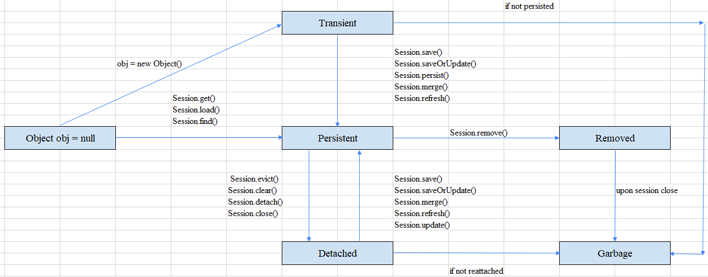

<br>

## Table of contents
- [Given problem](#given-problem)
- [Diving into some concepts in Hibernate framework](#diving-into-some-concepts-in-hibernate-framework)
- [Introduction to the Hibernate entity's lifecycle](#introduction-to-the-hibernate-entity's-lifecycle)
- [Understanding about the persistence context for each EntityManager's type](#understanding-about-the-persistence-context-for-each-entitymanager's-type)
- [Synchonize Persistence Context to the Database](#synchronize-persistence-context-to-the-database)
- [Wrapping up](#wrapping-up)


<br>

## Given problem

Suppose that we have a segment of code:

```java
@PersistenceContext
private EntityManager em;

@Transactional
public void doSomething() {
    Student student = buildStudentInfo();
    em.persist(student);

    student.setName("Something else");
    em.saveOrUpdate(studen);
}
```

How do we understand about the Student entity in Hibernate internally?

To be aware of the entity in Hibernate framework, we need to know more about the entity's state.

<br>

## Diving into some concepts in Hibernate framework

Before jumping directly into the lifecycle of the entity's state in Hibernate, we need to be aware of some concepts's definition.
1. EntityManagerFactory

    It is a factory class of EntityManager. It is used to create multiple instances of EntityManager class. It's a heavy-weight, and thread-safe object.
    
    Creating the EntityManagerFactory is an expensive operation, so to improve the performance, we can cache the instance.

    Each EntityManagerFactory maintains a metadata cache, object state cache, EntityManger pool, connection pool, ... If we don't need to use EntityManagerFactory, close it to free resources. Once an EntityManagerFactory has been closed, all its entity managers are considered to be in the closed state. While there are some active transactions working, calling EntityManagerFactory.close() method will throw an IllegalStateException exception.

    If we need to access multiple databases, we must configure one EntityManagerFactory per a database.

    After reading about EntityManager, we know that there are two types of EntityManager like container-managed, and application-managed. The creation of EntityManager instance is the same in both types. But the creation of EntityManagerFactory instance is different for both types.
    - With the container-managed option, the EntityManagerFactory instance will be automatically preinstantiated at the startup time, then subsequently creating and injecting the EntityManger under the control of container.

    - With the application-managed option, it's the applicaltion's responsibility to configure and create the factory.

2. Persistence Context

    A persistence context is a place that manages entities that currently, we are working with.

    Belows are some types of Persistence Context that we need to know.
    - Transaction-scoped persistence context

        In this type of persistence context, whenever a new transaction began, a new persistence context was created for both container-managed and application-managed EntityManager. It means that this persistence context's lifetime is accompanied with a transaction. It means that if we use transaction-scoped persistence context for entity without a transaction, a TransactionRequiredException exception will be thrown. A persistence context is created when a transaction is born, and similarly, when a transaction commits or rollbacks, a persistence context will be released.

        Belows are some cases to use Transaction-scoped persistence context:
        - If we use **@PersistenceContext** annotation without any configuration for an EntityManager instance, the default mode for persistence context is the transaction-scoped persitence context.

            For example:

            ```java
            @Service
            public class AnotherService {

                @PersistenceContext
                private EntityManager em;
            }
            ```

        - Using EntityManager with transactional-scoped persistence context doesn't belong to a transaction.

            For example:

            ```java
            @PersistenceContext
            private EntityManager em;

            public void doSomething(String studentId) {
                Student student = em.find(Student.class, studentId);
                student.setName("Something else");

                em.saveOrUpdate(student);
            }
            ```

            In this situation, each method invocation will create a new persistence context, performs the method action, and releases the persistence context.

            From an above example, we have:
            - with find() method, EntityManager will create a temporary persistence context, and after finishing this method, release this persistence context, and return a detached Student object.
            - then, we do something with this detached mode such as modifies some fields's value.
            - finally, calling **EntityManager.saveOrUpdate()** method also creates another temporary persistence context, convert a detached object to a persistent object, and release that persistence context.

    - Extended persistence context

        - The lifetime of extended persistence context spans multiple transactions.
        - If an entity is persisted without a transaction, it is only saved on the extended persistence context, not flush to the database. To fix this problem, we need to cover that in a transaction.
        - The extended persistence context doesn't allow persisting these entity with the same identifier.

3. EntityManager

    **EntityManager** is an interface provides some operations to interact with entities that are managed by Persistence Context. An **EntityManager** is associated with a persistence context.

    From Hibernate framework 5.2 and above, **Session** interface extends from **javax.persistence.EntityManager**.

    ```java
    public interface Session extends SharedSessionContract, EntityManager, HibernateEntityManager, AutoCloseable, Closeable {
        // ...
    }
    ```

    But from the lower Hibernate versions, **Session** interface doesn't extend from JPA's EntityManager.

    ```java
    public interface Session extends SharedSessionContract, java.io.Closeable {
        // ...
    }
    ```

    So, we need to take care which version that we currently use it.

    There are two types of **EntityManager**:
    - Container-managed

        The container-managed **EntityManager** means that the lifecycle of the **EntityManager**'s instances are completely in charge of the Spring container or Java EE's CDI, or briefly called as IoC container. It means that the flow of a transaction such as start a transaction, commit a transaction, and rollback, and the allocation, deallocation of an EntityManager managed by the IoC container.

        Suppose that our application has multiple **EntityManager**s, each operation of **EntityManager** will transform from an entity's A state to B state. But we know that a Persistence Context is a place that managed entities of our application, a question rises in our mind: **Can the B state of that entity be reflected to that same entity that is used by another EntityManager?**.

        The answer is **Yes, it can**. The Persistence Context is automatically propagated with the current JTA transaction, and **EntityManager** references that are mapped to the same persistence unit provide access to the persistence context within that transaction. By automatically propagating the persistence context, the Spring' beans or JavaEE's application components don't need to pass references to EntityManager instances to each other in order to make changes within a single transaction.

        To use properly an **EntityManager** in a Spring's Bean or JavaEE's application component, inject it with an annotation **@PersistenceContext**:

        ```java
        @PersistenceContext
        private EntityManager em;
        ```

    - Application-managed

        The application-managed EntityManager means that the **EntityManager**'s instances are managed by ourself or our applicaltion. 

        To answer an above question about the state of an entity in the container-managed EntityManager, the Persistence Context isn't propagated to Spring Beans or JavaEE's application components, and the lifecycle of EntityManager is managed by the applicaton.

        When to use:
        - When applications need to access a persistence context that is not propagated with the JTA transaction across **EntityManager** instances in a particular Persistence Unit. In this case, each **EntityManager** creates a new, isolated persistence context. The **EntityManager** and its associated persistence context are created and destroyed explicitly by the application.

        - When directly injecting **EntityManager** instances can't be done because **EntityManager** instances are not thread-safe. **EntityManagerFactory** instances are thread-safe.

        To utilize correctly a EntityManager instance, we can do like that.

        ```java
        // create EntityManagerFactory
        // 1st way:
        @PersistenceContext
        private EntityManagerFactory emf;

        // 2nd way
        private EntityManagerFactory emf = Persistence.createEntityManagerFactory(Constant.DEFINED_UNIT_NAME);

        // create EntityManager
        EntityManager em = emf.createEntityManager();
        ```

    The **EntityManager** instances are not thread-safe, so it doesn't work right away in a concurrent environment, then we need to use a single **EntityManager** per request. We need to take care about using an **EntityManager** instance. Because in Spring framework, the default scope of bean is singleton, so when we inject an container-managed EntityManager instance into a bean by an annotation **@PersistenceContext**, it means that we currently utilize that **EntityManager** instance as a singleton object. This is a bug.

    According to [https://www.baeldung.com/hibernate-entitymanager](https://www.baeldung.com/hibernate-entitymanager), we find that Spring container or Java EE CDI will inject a special proxy instead of a simple EntityManager. Spring injects a proxy of type **SharedEntityManagerCreator**. Every time we use the injected EntityManager, this proxy will either reuse the existing **EntityManager** or create a new one. The conclusion for this problem is that the container ensures that each **EntityManager** is confined to one thread.

4. Persistence Unit

    A persistence unit specifies all entity tables, which are managed by the EntityManagers of the application. Each persistence unit contains all classes representing the data stored in a single database.

    Normally, to provide the entity tables's name as a persisten unit, we should fill its name when [configured in an EntityManagerFactory](https://docs.oracle.com/cd/E19798-01/821-1841/bnbrj/index.html).

    Another way to configure persistence unit is that we will create a configuration file named as **persistence.xml**, which should be placed in the META-INF folder. Obviously, add the META-INF directory to the classpath of our application. 

5. Entity

    An entity is a lightweight persistent domain object. Each entity class will represent a table in our database, and an entity's instance will contain the data of a single row of that table.

    Each entity will have an **id** field that represents the primary key in the table.

    To define correctly an Entity class, we need to follow [some requirements](https://docs.oracle.com/cd/E19798-01/821-1841/6nmq2cpai/index.html):
    - The class must be annotated with the javax.persistence.Entity annotation.

    - The class must have a public or protected, no-argument constructor. The class may have other constructors.

    - The class must not be declared final. No methods or persistent instance variables must be declared final.

    - If an entity instance is passed by value as a detached object, such as through a session bean’s remote business interface, the class must implement the Serializable interface.

    - Entities may extend both entity and non-entity classes, and non-entity classes may extend entity classes.

    - Persistent instance variables must be declared private, protected, or package-private and can be accessed directly only by the entity class’s methods. Clients must access the entity’s state through accessor or business methods.

6. Transaction


<br>

## Introduction to the Hibernate entity's lifecycle

At this time, we will continue to discuss about the lifecycle of an entity or about the entity's states.

Below is an image that describe the relationship between an entity's state.



1. Transient state

    An entity object is instantiated by using new operator, that will be called as a transient object.

    The Persistence Context doesn't managed it. And of course, this transient object doesn't associated with 

    ```java
    StudentEntity student = new StudentEntity();
    student.setAge(20);
    student.setName("Google");
    ```

    From the transient state to persistent state, there are some methods that supports:

    ```java
    // Hibernate 5.4
    public interface Session {
        // persist
        void persist(Object object);

        void persist(String entityName, Object object);

        // refresh
        void refresh(Object object);

        void refresh(Object object, LockMode lockMode);

        void refresh(Object object, LockOptions lockOptions);

        void refresh(String entityName, Object object);

        void refresh(String entityName, Object object, LockOptions lockOptions);

        // merge
        Object merge(Object object);

        Object merge(String entityName, Object object);

        // save
        Serializable save(Object object);

        Serializable save(String entityName, Object object);

        // saveOrUpdate
        void saveOrUpdate(Object object);

        void saveOrUpdate(String entityName, Object object);
    }
    ```

    If the persist() method is called on the detached object, IllegalArgumentException will be thrown.

2. Persistent state

    A persistent object is an object that associates with a database record. From that, the Persistence Context will manage it, and cache that object state, easily be aware of its modification.

    To retrieve the persistent object from a database, some methods will supports:

    ```java
    public interface Session {
        // load
        <T> T load(Class<T> theClass, Serializable id);

        <T> T load(Class<T> theClass, Serializable id, LockMode lockMode);

        <T> T load(Class<T> theClass, Serializable id, LockOptions lockOptions);

        void load(Object object, Serializable id);

        Object load(String entityName, Serializable id);
        
        Object load(String entityName, Serializable id, LockMode lockMode);
        
        Object load(String entityName, Serializable id, LockOptions lockOptions);

        // get
        <T> T get(Class<T> entityType, Serializable id);

        <T> T get(Class<T> entityType, Serializable id, LockMode lockMode);

        <T> T get(Class<T> entityType, Serializable id, LockOptions lockOptions);

        Object get(String entityName, Serializable id);

        Object get(String entityName, Serializable id, LockMode lockMode);

        Object get(String entityName, Serializable id, LockOptions lockOptions);

        // other queries such as find, ...
    }
    ```

    The following methods to make the persistent object become transient object.

    ```java
    public interface Session {
        void delete(Object object);

        void delete(String entityName, Object object);
    }
    ```

    Some methods to convert the persistent object to detached object.

    ```java
    public interface Session {
        // from EntityManager interface
        void detach(Object entity);

        void evict(Object object);

        void clear();

        // from EntityManager interface
        void close();
    }
    ```

3. Detached state

    After a transaction is closed, the persistence context doesn't exist. Then the application still has the entity's reference in that persistence context. So, that object is considered as the detached object. 

    Belows are some ways that the persistent object transform to the detached object.
    - When the transaction (in transaction-scoped persistent context) commits, entities managed by the persistence context become detached.
    - If an application-managed persistence context is closed, all managed entities become detached.
    - Using detach(), evict(), clear(), and close() methods.
    - Rollback action will be called.
    - In the extended persistence context, when a stateful bean is removed, all managed entities become detached.

    Some methods to convert the detached object into the persistent object:

    ```java
    public interface Session {

        // update
        void update(Object object);

        void update(String entityName, Object object);

        // saveOrUpdate
        void saveOrUpdate(Object object);

        void saveOrUpdate(String entityName, Object object);

        // lock
        void lock(Object object, LockMode lockMode);

        void lock(String entityName, Object object, LockMode lockMode);

        // replicate
        void replicate(Object object, ReplicationMode replicationMode);

        void replicate(String entityName, Object object, ReplicationMode replicationMode);

        // merge
        Object merge(Object object);

        Object merge(String entityName, Object object);
    }
    ```

    Before detaching an entity, we should remember to **flush** all changes in the Persistence Context to database.

4. Removed state

    When a delete() or remove() method are called on a persistent object, this object will be converted to the detached object.

    When an object is removed, the Persistence Context deletes the object from the database. It means that we shouldn't use any references to the removed object in the application because if some modifications happen in these references, won't reflect to the database.

    If the remove() method is called on the detached object, IllegalArgumentException will be thrown. Otherwise, the remove() method is called on the persistent object that is in a bidirectional relationship (using cascade = REMOVE or cascade = ALL) with the other persistent object, then remove operation will be called on that persistent object. If the remove() method is called on the removed object, nothing happens.

    To move from the persistent state to the removed state, follow the below methods:

    ```java
    public interface Session {
        void delete(Object object);

        // from EntityManager interface
        void remove(Object entity);
    }
    ```

<br>

## Understanding about the persistence context for each EntityManager's type

1. Container-managed EntityManager

    To configure the persistence context in the container-managed EntityManager, use the **PersistenceContextType type** field of **@PersistenceContext** annotation.

    ```java
    @Target(value={TYPE, METHOD, FIELD})
    @Retention(value=RUNTIME)
    public @interface PersistenceContext {
        String name;
        PersistenceProperty[] properties;
        SynchronizationType synchronization;
        PersistenceContextType type;
        String unitName;
    }
    ```

    The **PersistenceContextType** enum has two value:
    - **EXTENDED** - extended persistence context
    - **TRANSACTION** - transaction-scoped persistence context.

        By default, the value **PersistenceContextType.TRANSACTION** is used.
    
    Belows are some information of the persistence context's type in Container-managed EntityManager.
    - Transaction-scoped persistence context

        We can read up on about the transaction-scoped persistence context in the section [Diving into some concepts in Hibernate framework](#diving-into-some-concepts-in-hibernate-framework).
        

    - Extended persistence context

        We can read up on about the extended persistence context in the section [Diving into some concepts in Hibernate framework](#diving-into-some-concepts-in-hibernate-framework).

        A persistence context is created after calling **EntityManagerFactory.createEntityManager()** method. When a persistence context releases by calling **EntityManager.close()** method, entities under that persistence context will be in the detached state.

2. Application-managed EntityManager

    When using application-managed EntitManager, we will call **createEntityManager()** method to create a new **EntityManager** instance, then, it will only used an **Extended persistence context** corresponding to that EntityManager.

    A persistence context is created after calling **EntityManagerFactory.createEntityManager()** method. When a persistence context releases by calling **EntityManager.close()** method, entities under that persistence context will be in the detached state.

<br>

## Synchonize Persistence Context to the Database

Belows are some cases that the Persistence Context is synchronized with the database.
1. after transaction commits.

2. after the flush() method is called on that Session.

    The flush() method updates the database with the modified copies of the objects.

    The refresh() updates the object model with the latest copy of the records, reading from the database.

    Now, we will continue to work with the flush mode. This flush mode can affect to the performance when querying.

    Consider about the FlushMode enum:

    ```java
    public enum FlushMode {
        // The Session is flushed before every query
        ALWAYS,

        // The Session is sometimes flushed before every query execution in order to ensure that queries never return stale state
        AUTO,

        // The Session is flushed when EntityManager.commit() is called
        COMMIT,

        // The Session is only ever flushed when Session.flush() is explictly called by the application
        MANUAL;
    }
    ```


<br>

## Wrapping up

- With the container-managed EntityManager, the persistence context is shared across the multiple Spring Beans or JavaEE's application components. Otherwise, it's not right for the application-managed EntityManager.


<br>

Refer:

[https://ducmanhphan.github.io/2020-02-16-the-architecture-of-JPA/](https://ducmanhphan.github.io/2020-02-16-the-architecture-of-JPA/)

[https://medium.com/@superjunior.dev/hibernate-ph%C3%A2n-bi%E1%BB%87t-c%C3%A1c-h%C3%A0m-save-persist-update-merge-saveorupdate-c1140663bc59](https://medium.com/@superjunior.dev/hibernate-ph%C3%A2n-bi%E1%BB%87t-c%C3%A1c-h%C3%A0m-save-persist-update-merge-saveorupdate-c1140663bc59)

[https://www.baeldung.com/jpa-hibernate-persistence-context](https://www.baeldung.com/jpa-hibernate-persistence-context)

[https://docs.jboss.org/hibernate/orm/4.0/devguide/en-US/html/ch03.html](https://docs.jboss.org/hibernate/orm/4.0/devguide/en-US/html/ch03.html)

[https://stackoverflow.com/questions/19930152/what-is-persistence-context](https://stackoverflow.com/questions/19930152/what-is-persistence-context)

[https://docs.jboss.org/hibernate/entitymanager/3.6/reference/en/html_single/#architecture](https://docs.jboss.org/hibernate/entitymanager/3.6/reference/en/html_single/#architecture)

[https://docs.oracle.com/javaee/7/api/javax/persistence/EntityManager.html](https://docs.oracle.com/javaee/7/api/javax/persistence/EntityManager.html)

[https://docs.oracle.com/javaee/7/tutorial/persistence-intro003.htm](https://docs.oracle.com/javaee/7/tutorial/persistence-intro003.htm)

[https://docs.oracle.com/cd/E19798-01/821-1841/6nmq2cpai/index.html](https://docs.oracle.com/cd/E19798-01/821-1841/6nmq2cpai/index.html)

[https://docs.oracle.com/cd/E19798-01/821-1841/bnbqn/index.html](https://docs.oracle.com/cd/E19798-01/821-1841/bnbqn/index.html)

[https://docs.oracle.com/cd/E16439_01/doc.1013/e13981/usclient005.htm](https://docs.oracle.com/cd/E16439_01/doc.1013/e13981/usclient005.htm)

[https://stackoverflow.com/questions/31964927/does-jpas-commit-method-make-entity-detached](https://stackoverflow.com/questions/31964927/does-jpas-commit-method-make-entity-detached)

[https://sites.google.com/site/mostlyjava/scbcd/07-persistence-units-and-persistence-contexts](https://sites.google.com/site/mostlyjava/scbcd/07-persistence-units-and-persistence-contexts)