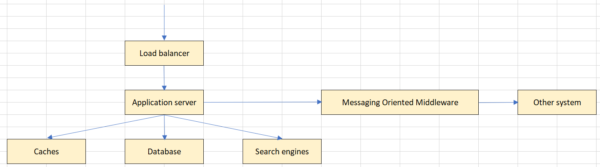

<br>

## Table of contents
- [Given problem](#given-problem)
- [Solution of using RESTful system](#solution-of-using-restful-system)
- [Idempotency in RESTful API](#idempotency-in-restful-api)
- [HATEOAS constraints in RESTful API](#hateoas-constraints-in-restful-api)
- [Benefits and Drawbacks](#benefits-and-drawbacks)
- [Wrapping up](#wrapping-up)

<br>

## Given problem

In this article, we will find out some principles, constraints of RESTful system, and analyze some particular properties that we need to follow.

Now, let's get started.

<br>

## Solution of using RESTful system

1. Definition of RESTful API

    According to [wikipedia.com](https://en.wikipedia.org/wiki/API), we have a definition of API:

    ```
    An API, acronym of Application Program Interface, is an interface that defines interactions between multiple software applications or mixed hardware-software intermediates. It defines the kind of requests that can be made, how to make them, the data formats that should be used, the conventions to follow, ... Through information hiding, APIs enable modular programming, allowing users to use the interface independently of the implementation.
    ```

    A REST API (known as RESTful API), an acronym of REpresentational State Transfer, is an API that conforms to the constraints of REST architectural style. And the REST architectural style contains six principles that we need to know.
    - Client-server
    - Stateless
    - Cacheable
    - Uniform interface
    - Layered system
    - Code on demand

2. Principles of RESTful API

    - Client-server

        Use this architecture to split the responsibilities between client and server. The client will only take care about UI, display information for the end user, does not contain business logic. And the server will process the business logic, communicate with the other external systems such as databases, caches, ...

        Through the Restful API, it hides all complicated implementation to the server.

        Benefits:
        - easy to scale servers when processing multiple requests at the same time.
        - improve the availability.
        - support multiple types of client such as mobile, web, other systems.

        Drawbacks:
        - less security when comparing to 1-tier architecture.

    - Stateless

        The server will not save all information of requests, and the relationship among requests is independent.
        
        Benefits:
        - It reduces the lack of security when the server is hacked.
        - It improves the scalability because our servers doesn't need to manage a state across multiple requests.

    - Cacheable

        It means that the RESTful system will support a caching system. And the data will be cached in different levels such as:
        - client

            In some browsers, we can use an HTTP header **cache-control** to specify caching policies in both client requests and server responses. Policies include how a resource is cached, where it's cached and its maximum age before expiring.

        - server

            When a result is calculated from the heavy operations on the server, it can be cacheable in the other external systems such as Redis, memcache, ...

            If we use Hibernate or other ORM frameworks, it also supports caching query responses.

        - proxy

            Normally, we can cache the static content such as media, javascript or css files.

        - gateway

    - Uniform interface

        In some programming languages, decoupling among multiple modules is a necessary thing that we need to do. The Single Responsibility principle, Dependency Inversion principle are useful to apply decoupling.
        - With Single Responsibility principle, isolate the responsibility between modules to avoid the code fragility, the code rigidity.
        - With Dependency Inversion principle, using interface or abstract is the best way to achieve it. Without based on the specific classes, we only need an interface to provide a contract between classes, modules, components.

        Expanding these principles for the client-server architecture, we also need an interface between clients and servers to decouple between other components in our system.

        Because our system will serve multiple types of clients such as web, app, ..., so the uniform interface principle means that it will provide uniform ways to the other types of clients. Then clients and servers will exchange information, considered as resources, by using a standardized interface and protocol.

        Belows are some constraints for the Uniform Interface principle:
        - Resource Identification through API

            To access our resources on a server, we need to use URI - Uniform Resource Identifier.

        - Manipulation of resources through these representations

            The representation of resources are known as the URI, and combine with some HTTP methods such as POST, GET, PUT, DELETE, PATCH, will provide actions to these resources.
            - Get method retrieves the current state of a resource.
            - Post method creates a new resource.
            - Put method updates a resource that has already existed.
            - Delete method deletes a resource.
            - Patch method update a part of a resource.

        - Self-descriptive messages

            Each message will contain enough information to help a server can easily understand more about it. For example, with Restful API, we normally use json format for a message, then header content-type is **application/json**.

        - Stateful interactions through hyperlinks

    - Layered system

        This principle will used to satisfy the seperation of concerns by splitting a system into multiple layers. The current layer will only communicate with the above layer or the below layer, and the above layers rely on the below layers to perform its functionality.
        
        Each layer will have a specific responsibility.
        - The load balancer will route client requests across alll application servers, and there isn't any server under high load.
        - The application server will mainly process client requests, follow the business rules.
        - The cache servers will contain the result of expensive calculation operations from the previous requests, so with the other requests, our application server only need to access the cache server to get it.

        

        Benefits:
        - It improves scalability by enabling load balancing.
        - It improves the performance by providing shared caches at different levels.

    - Code on demand

        This constraint is optional. It means that the functionality of the clients can be applied dynamically at the runtime based on the server.

<br>

## HATEOAS constraints in Restful API

HATEOAS, an acronym of Hypermedia As The Engine Of the Application State, is a way which the server will guide the client what's the next steps that it can do. It means that the client will start at the specific entry point, then the following actions will depends on the server.

For example:

```java
// request
GET /accounts/12345 HTTP/1.1
Host: bank.example.com
Accept: application/vnd.acme.account+json
...

// response
HTTP/1.1 200 OK
Content-Type: application/vnd.acme.account+json
Content-Length: ...

{
    "account": {
        "account_number": 12345,
        "balance": {
            "currency": "usd",
            "value": 100.00
        },
        "links": {
            "deposit": "/accounts/12345/deposit",
            "withdraw": "/accounts/12345/withdraw",
            "transfer": "/accounts/12345/transfer",
            "close": "/accounts/12345/close"
        }
    }
}
```

After sending GET request **/accounts/12345**, there are four next actions that the client will need to take care, for example, deposit, withdraw, transfer, close.

<br>

## Idempotency in Restful API

1. Definition of Idempotency

    Idempotency is the property that when we pass the same argument in the multiple times, we always receive the same output. This concept of Idempotency is as same as the referential transparency's concept of functional programming.

    For example:

    ```java
    GET http://host:port/api/v1/persons
    ```

    GET method is considered as the idempotent method. Because we always get the same output when calling the above API.

    Below is a table that depict the idempotency of Http methods.

    |         Http method        |        Idempotent       |
    | -------------------------- | ----------------------- |
    | GET                        | YES                     |
    | POST                       | NO                      |
    | PUT                        | YES                     |
    | DELETE                     | YES                     |

2. Benefits and Drawbacks

    - Benefits

        - It makes us doesn't confused about our system when the APIs is not idempotent.
        - Easier to maintain because we only need less time to understand about the background of APIs. And there're less weird cases that we need to take care.
        - Easier to test.

    - Drawbacks

        - When we choose multiple APIs that have idempotency, our project should abide by this rule. It takes times to think about each API.

<br>

## Benefits and Drawbacks

1. Benefits

    - If the system abides by strictly the principles of RESTful system, the system can satisfy some non-functional requirements such as scalability, availability, performance, reliability.
    - When we use HATEOAS constraint in our RESTful system, the servers can drive UI, and actions that the clients need. It's useful for mobile because we doesn't need to change or deploy application again. So it reduce the development time.

2. Drawbacks

<br>

## Wrapping up

- Nowadays, we always cope with the systems that utilizes RESTful API, so understanding so deep about it is really necessary.

- RESTful is not a protocol, it is only a set of constraints that help us to build RESTful system. And RESTful architectural style is not specific to any protocol, because of depending on the uniform resource with URI, so any protocols that support URI, then RESTful can work on it.

<br>

Refer:

[https://www.ics.uci.edu/~fielding/pubs/dissertation/top.htm](https://www.ics.uci.edu/~fielding/pubs/dissertation/top.htm)

[https://restfulapi.net/](https://restfulapi.net/)

[https://kipalog.com/posts/Idempotency-va-Safety-trong-RESTful-web-services](https://kipalog.com/posts/Idempotency-va-Safety-trong-RESTful-web-services)

[https://www.restapitutorial.com/lessons/idempotency.html](https://www.restapitutorial.com/lessons/idempotency.html)

[https://www.baeldung.com/cs/idempotent-operations](https://www.baeldung.com/cs/idempotent-operations)

[https://aws.amazon.com/builders-library/making-retries-safe-with-idempotent-APIs/](https://aws.amazon.com/builders-library/making-retries-safe-with-idempotent-APIs/)

[https://nordicapis.com/understanding-idempotency-and-safety-in-api-design/](https://nordicapis.com/understanding-idempotency-and-safety-in-api-design/)

[https://microservices.io/patterns/communication-style/idempotent-consumer.html](https://microservices.io/patterns/communication-style/idempotent-consumer.html)

[https://www.codeproject.com/Tips/788823/Advantages-of-Making-Your-Methods-Idempotent-and-S](https://www.codeproject.com/Tips/788823/Advantages-of-Making-Your-Methods-Idempotent-and-S)

[https://en.wikipedia.org/wiki/HATEOAS](https://en.wikipedia.org/wiki/HATEOAS)

[https://blog.stackpath.com/proxy-caching/](https://blog.stackpath.com/proxy-caching/)