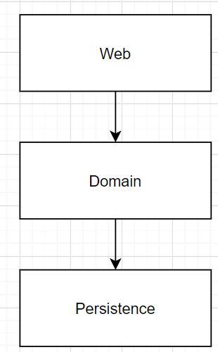
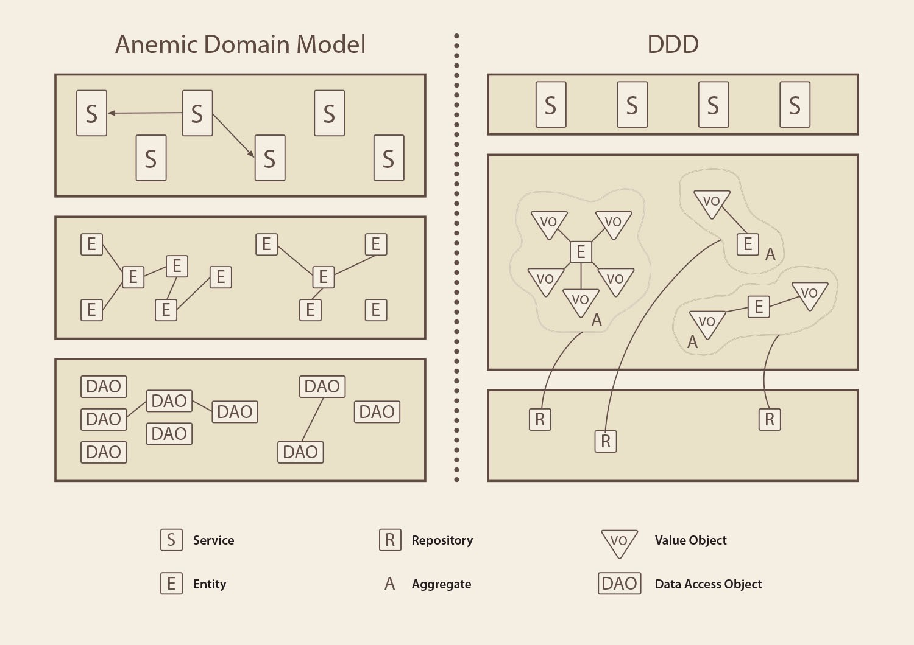

<br>

## Table of contents
- [Given problem](#given-problem)
- [Solution with Domain Model pattern](#solution-with-domain-model-pattern)
- [When to use](#when-to-use)
- [Benefits and Drawbacks](#benefits-and-drawbacks)
- [Wrapping up](#wrapping-up)

<br>

## Given problem

We knew that 3-layer architecture can be depicted as the following image.



The Domain layer wil contain the business logic that implements some operations such as validation, business rules, ... Then, in reality, the service classes will posses these implementations.

And the data of our Domain is represented through by Entities. Each entity will have its own identity. It means that we can differentiate between entities relied on their identity. Next, entities are also reflected to the records in the database. To persist entities, the service classes will call the repository/DAO object to do that job.

From my understanding about Domain Model, we have the concept Anemic Domain Model that has the relationship between the service classes and entities.

```
Anemic Domain Model = Entity + Service
```

Drawbacks of Anemic Domain Model:
- The approach of Anemic Domain Model is the data first, not domain logic. So, it doesn't adapt to the changes of the customer' s requirements.

- Lack of encapsulation.

    To know more about encapsulation in object-oriented programming, we can refer to the following [link](https://ducmanhphan.github.io/2019-12-19-encapsulation-in-object-oriented-programming/).

- Difficult to maintain because the business (domain) logic will be used to expand in multiple layers. So when we want to add a new functionality or fix an existed feature, it is a conundrom.

- The domain will be splitted in the multiple layers such as persistence layer, or sometimes, web layer. 

Therefore, how do we solve the anemic domain model's problems? 

<br>

## Solution with Domain Model pattern

To summary about some patterns of Domain-Driven Design, we can refer to the below image.


But in this article, we only concentrate mostly on the Rich Domain Model pattern.

Rich Domain Model is a model that has both its data and operations that it needs to work.

Below is an image that describe its meaning.



For example:

```java
public class Rectangle {
    private int height;
    private int width;

    public Rectangle(int height, int width) {
        this.height = height;
        this.width = width;
    }

    public int calculateArea() {
        return this.height * this.width;
    }

    public int getHeight() {
        return this.height;
    }

    public int getWidth() {
        return this.width;
    }
}
```

To make the above Rectangle class towards more about Domain-Driven Design, we can use [Value Object pattern](https://ducmanhphan.github.io/2020-09-02-value-object-pattern/).

To continue with domain model, we can learn about some new concepts in Domain-Driven Design:
- Entity
- Value Object
- Aggregate

<br>

## When to use

- When we want to apply Domain-Driven Design in our project.

- When our project want to describe the business domain exactly, and we have enough time to do it.

<br>

## Benefits and Drawbacks

1. Benefits

    - Squeeze all business logic into domain models, so it reduces the duplications logic and make the data consistency by using value object pattern, aggregate pattern, and specification pattern.

2. Drawbacks

    - To go deeper into the drawbacks of Domain Model, we can go to the drawbacks of Aggregate pattern.

<br>

## Wrapping up

- Business logic contains domain logic and application logic.

    - Domain logic does something purely with the problem domain such as strategies for calculating revenue recognition on a contract. Domain logic contains validation, calculations, and business rules.

    - Application logic has to do with application responsibilities such as notifying contract administrators, and integrated applications, or revenue recognition calculations.

        Application logic is sometimes referred to as **workflow logic**:

- In Domain-Driven Design or Microservice architecture, we still use Anemic Domain Model to implement based largely on the needs of bounded contexts.

- The Anemic Domain Model is applicable when:

    - our project is simple.
    - will not be developed for a long period of time.

<br>

Refer:

[https://danielrusnok.medium.com/what-is-anemic-domain-model-and-why-it-can-be-harmful-2677b1b0a79a](https://danielrusnok.medium.com/what-is-anemic-domain-model-and-why-it-can-be-harmful-2677b1b0a79a)

[https://blog.pragmatists.com/domain-driven-design-vs-anemic-model-how-do-they-differ-ffdee9371a86](https://blog.pragmatists.com/domain-driven-design-vs-anemic-model-how-do-they-differ-ffdee9371a86)

[https://www.martinfowler.com/bliki/AnemicDomainModel.html](https://www.martinfowler.com/bliki/AnemicDomainModel.html)

[https://enterprisecraftsmanship.com/posts/always-valid-domain-model/](https://enterprisecraftsmanship.com/posts/always-valid-domain-model/)

[https://enterprisecraftsmanship.com/posts/domain-model-purity-lazy-loading/](https://enterprisecraftsmanship.com/posts/domain-model-purity-lazy-loading/)
